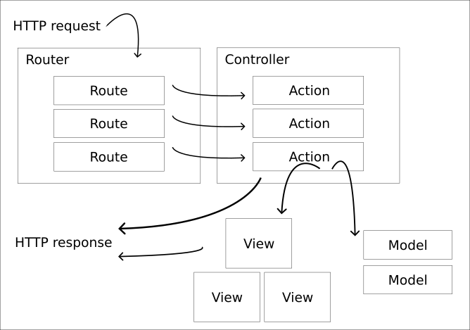

# dbwebb-mvc-v2



En me-sida till kursen mvc-v2 på Blekinge Tekniska Högskola

## Klona projektet

```
git clone https://github.com/chei21/dbwebb-mvc-v2
```

## Kör projektet

```
php -S localhost:8888 -t public
```

Gå till https://localhost:8888